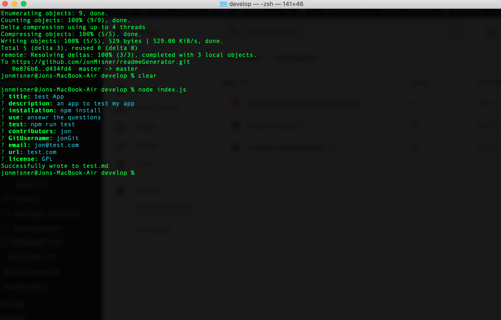
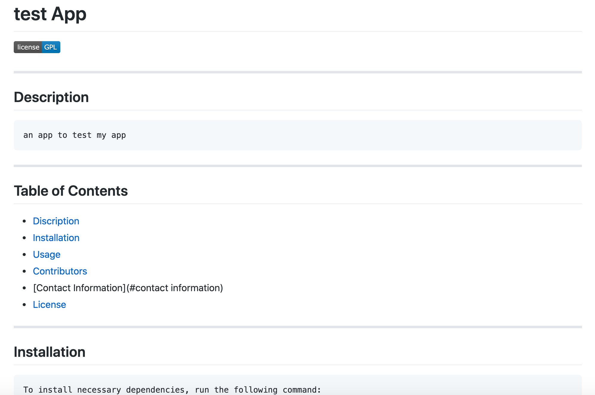

# readmeGenerator
Dynamically generated, professional READMEs

## usage
   Answer all the questions and it will generate a read me for you!

   
   

## contributors
   Jon Misner with a shout out to Joseph Young for advising on some JS.

  if there are any questions you can contact me at JonMisner86@gmail.com 